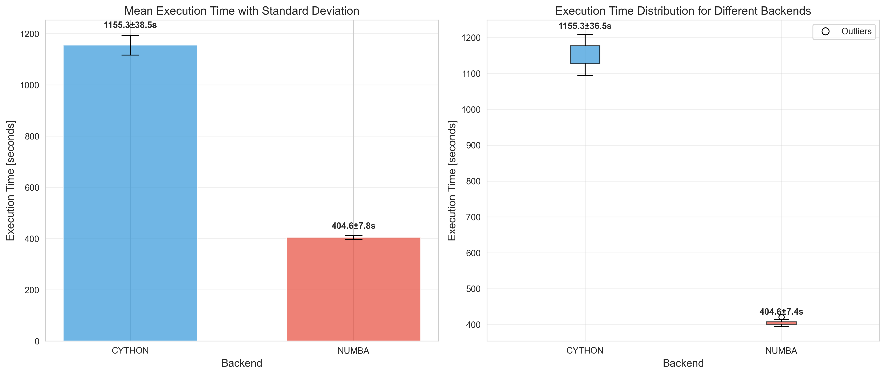
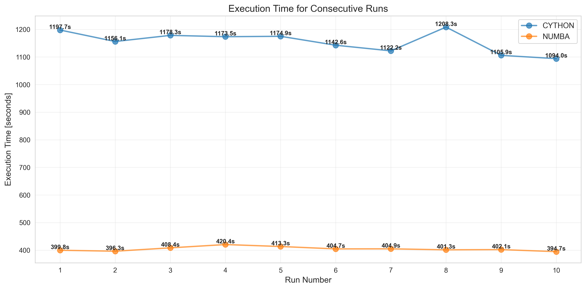
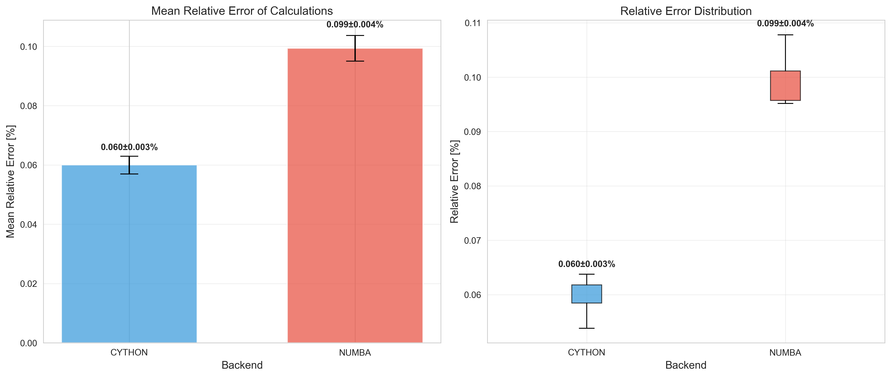
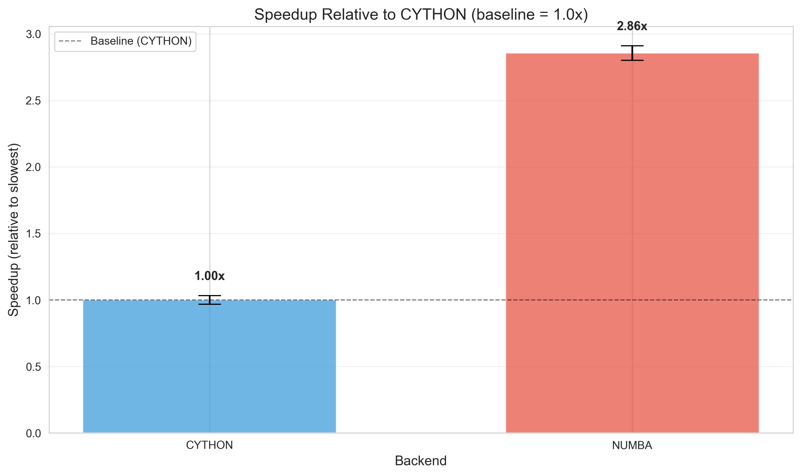
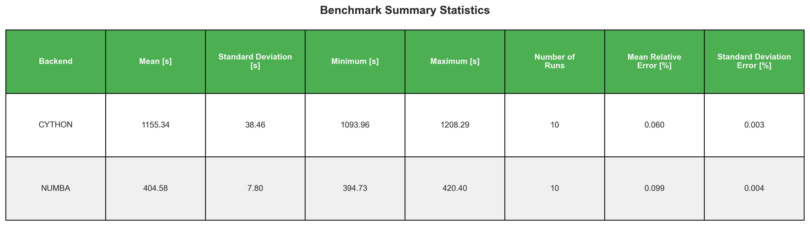

# Benchmark of Backend Engines (BE) on 2019_DCPT experimental data

## Objective
This README documents **backend engine (BE) comparison** for `IonTracks-Cython` on the `2019_DCPT` case.

The comparison focuses on:

- runtime performance,
- numerical agreement with experimental recombination data,
- run-to-run stability,
- practical backend selection trade-offs.

## Scope and benchmark setup
Benchmark target: `backend-performance-benchmark/2019_DCPT/`

Compared backends:

- `python`
- `cython`
- `numba`

Benchmark metadata (`backend-performance-benchmark/2019_DCPT/benchmark_results/metadata_20251210_003508.json`):

- runs per backend: 10
- total runs: 30
- status labels: `success`, `efficiency_failed`, `failed`

## Experimental reference data (used for BE comparison)
The benchmark is evaluated against the experimental dataset now available under:

- `backend-performance-benchmark/2019_DCPT/experimental-data-200V/recombination_200V_data.csv`

Dataset summary:

- particle: proton beam
- chamber voltage: 200 V
- electrode gap: 0.2 cm (2 mm)
- energies: 70, 150, 226, 244 MeV
- reference output: recombination factor `k_s`

Supporting context is included in:

- `backend-performance-benchmark/2019_DCPT/experimental-data-200V/README.md`

## Where benchmark outputs are stored
Main benchmark outputs are in:

- `backend-performance-benchmark/2019_DCPT/benchmark_results/summary_all_runs_20251210_003508.csv`
- `backend-performance-benchmark/2019_DCPT/benchmark_results/statistics_summary_20251210_003508.csv`
- `backend-performance-benchmark/2019_DCPT/benchmark_results/plots/`
- `backend-performance-benchmark/2019_DCPT/benchmark_results/cython/run_001 ... run_010/`
- `backend-performance-benchmark/2019_DCPT/benchmark_results/numba/run_001 ... run_010/`
- `backend-performance-benchmark/2019_DCPT/benchmark_results/python/run_001 ... run_010/`

Each successful `cython`/`numba` run contains:

- `comparison_initial.csv`
- `comparison_continuous.csv`
- `comparison_continuous_clean.csv`
- `initial_recombination_comparison.png`
- `continuous_beam_comparison.png`
- `relative_error.png`
- `run_log.txt`

`python` runs store logs only (`run_log.txt`) due to efficiency failures.

## BE comparison results
### 1) Performance (execution time)
Average runtime over 10 runs:

- `numba`: **404.58 s** (std 7.80 s, min 394.73 s, max 420.40 s)
- `cython`: **1155.34 s** (std 38.46 s, min 1093.96 s, max 1208.29 s)
- `python`: **6953.67 s** (10/10 `efficiency_failed`, max 47830.96 s)

Outlier-aware view:

- `python` without the 47,830.96 s outlier: **2411.75 s** mean (n=9)

Relative speed:

- `numba` vs `cython`: **2.86x faster**
- `numba` vs `python`: **17.19x faster** (with outlier)
- `cython` vs `python`: **6.02x faster** (with outlier)
- without the python outlier: `numba` is still **5.96x** faster than `python`





### 2) Accuracy - initial recombination
For `cython` and `numba`, results are effectively identical:

- mean relative error: **-0.0455%**
- range: **-0.0649% to -0.0238%**

Interpretation: no meaningful BE-level difference for initial recombination on this case.

### 3) Accuracy - continuous beam
Mean relative error across runs:

- `cython`: **0.05997%** (std 0.00298 pp)
- `numba`: **0.09935%** (std 0.00433 pp)

Observed maxima in runs:

- `cython`: typically ~0.10-0.12%
- `numba`: typically ~0.18-0.20%

Accuracy delta (`cython` advantage):

- absolute: **0.0394 percentage points**
- relative reduction vs `numba`: **~39.6%**



### 4) Stability
- `numba`: very stable runtime distribution (low variance).
- `cython`: moderate runtime variance, all runs successful.
- `python`: fails the efficiency criterion in all runs.

Efficiency criterion used for `python` in this benchmark:

- timeout threshold per run was set to **2x max(runtime of `cython`, runtime of `numba`)**,
- when this threshold was exceeded, the run was marked as `efficiency_failed`.





## Interpretation for backend choice
- If primary priority is **runtime throughput/latency**, choose **`numba`**.
- If primary priority is **continuous-beam numerical accuracy**, choose **`cython`**.
- `python` is not suitable for this benchmark profile under the current efficiency constraint.
- In practice for this workload, `python` should be considered **not recommended in all cases** (performance and efficiency are consistently inferior to both accelerated backends).

In short, this benchmark shows a clear BE trade-off:

- **`numba` = best speed**
- **`cython` = best continuous-beam accuracy**

## How to reproduce the benchmark inputs/results
A short reproduction note is included here:

- `backend-performance-benchmark/2019_DCPT/experimental-data-200V/how_to_reproduce_results.md`

Use that guide to regenerate the comparison artifacts (`comparison_*.csv`, plots, relative error chart) from the experimental data configuration.

Primary scripts for rerunning BE benchmark/plots:

- `backend-performance-benchmark/2019_DCPT/run_benchmark.py`
- `backend-performance-benchmark/2019_DCPT/plot_benchmark_results.py`

PowerShell example:

```powershell
python .\backend-performance-benchmark\2019_DCPT\run_benchmark.py
python .\backend-performance-benchmark\2019_DCPT\plot_benchmark_results.py
```

Note: if you reproduce from custom config files, make sure the experimental data path points to the current benchmark-local dataset (`backend-performance-benchmark/2019_DCPT/experimental-data-200V/...`).
